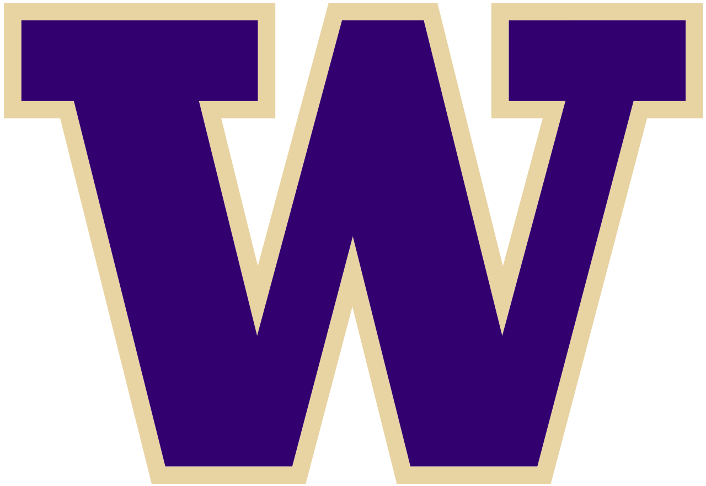
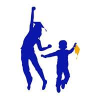

## University of Washington
- *Research Scientist/Engineer* | Sep'20 - May'22
- 
- Tags: Work
- Badges:
  - Badge [blue]
- List Items:
  - Leveraged Java tools (ImageJ/Fiji) in analysis of neuronal development in Drosophila melanogaster
  - Developed genetic schemas for efficient and rigorous experimentation
  - Mentored and trained undergraduate researchers in laboratory techniques and methodologies

## Menchie's
- *Shift Lead* | Jun'18 - Aug'20
- 
- Tags: Non professional work
- Badges:
  - Badge [blue]
- List Items:
  - Configured and troubleshooted transactional systems and store machines.
  - Led and organized team members in store operations.

## Federal Way Public Schools
- *Teacher's Assistant* | Jun'17 - Sept'17
- 
- Tags: Non professional work
- Badges:
  - Badge [blue]
- List Items:
  - Collaborated with K-8 students in an extracurricular summer program on software development, taking the lead due to the absence of an instructor.
  - Leveraged cutting-edge interactive technologies, including robotics and mobile applications, to foster a captivating and immersive learning experience for students.
  - Developed comprehensive and engaging lesson plans daily.

<!-- ## Other
- *Role* | Mar'23 - Apr'23
- 
- Tags: Category 3
- Badges:
  - Badge [blue]
- List Items:
  - Point 1
  - Point 2 -->