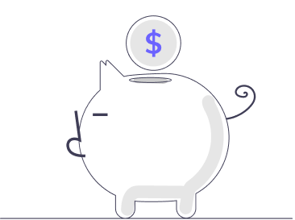
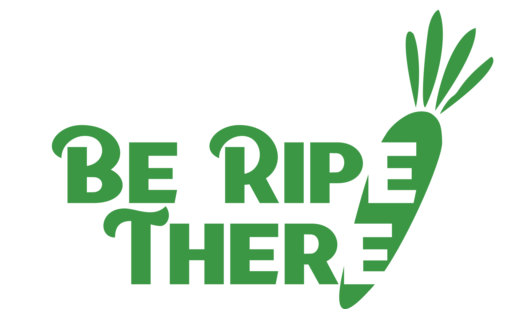
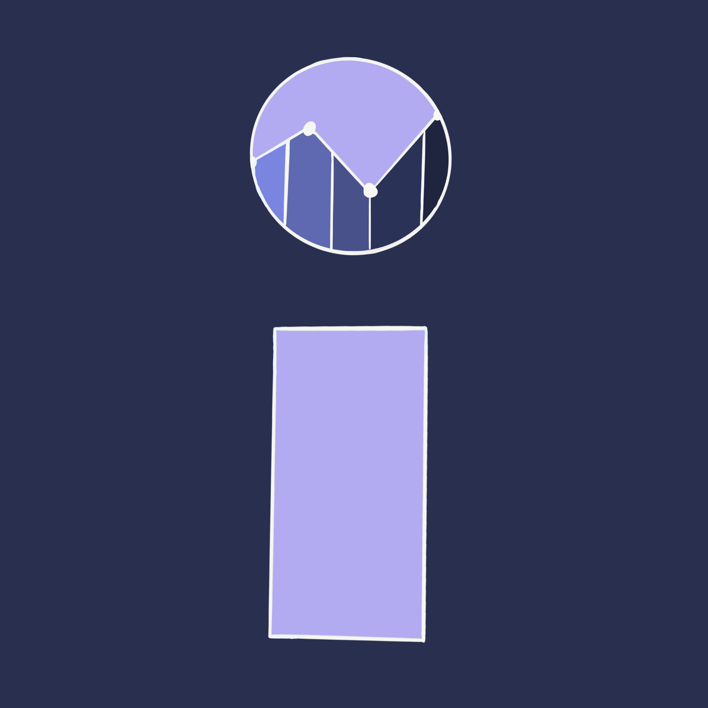

## Budgit
Personal finance app that lets users create budgets and aggregate data from all of their financial institutions.
- 
- Tags: Category 1
- Badges:
  - In progress [blue]
  - React [pink]
  - Express [green]
  - MySQL [yellow]
- Buttons:
  - Link [https://example.com]

## Be Ripe There
App serving as a healthy recipe finder and nutrition tracker. The project involves collaboration with Carl Arenas, a UX designer to ensure an intuitive user experience.
- 
- Tags: Category 2
- Badges:
  - In progress [blue]
  - React Native [pink]
  - Spring [green]
  - MySQL [yellow]
- Buttons:
  - Link [https://example.com]

## Inventori
Inventory app catered toward small businesses so that they can track inflation trends on their items for more informed spending.
- 
- Tags: Category 3
- Badges:
  - React [pink]
  - Express [green]
  - MongoDB [yellow]
- Buttons:
  - Link [https://example.com]